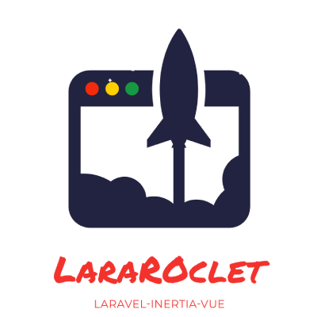

<p align="center"><a href="https://github.com/oneassistpro/lararocket-skeleton" target="_blank"></a></p>

**LaraRocket-Skeleton** is a ready-to-use web application skeleton built with a modern stack, including Laravel, InertiaJS, VueJS, and Laravel Breeze for authentication. It comes pre-configured with a suite of developer-friendly tools to streamline your workflow, letting you focus entirely on your application's development.

**LaraRocket-Skeleton** is designed to simplify the process of starting a new project. It eliminates the repetitive setup tasks and provides a solid foundation for developers to jump straight into base development.

## 🌟 Features

- Laravel Framework: Robust and scalable backend framework.
- InertiaJS + VueJS: Build dynamic, reactive, and modern web apps without the complexity of a full SPA.
- Laravel Breeze: Pre-configured authentication with clean scaffolding.
- PestPHP: Includes 100% test coverage for reliable and maintainable code.
- PHPStan: Configured at level 9 with zero errors for maximum static code analysis.
- Laravel Pint: Ensures consistent coding style with standard code formatting.
- Rector: Automates code refactoring for modern, clean, and optimized code.
- 100% TypeScript: Ensures type safety, improved code quality, and enhanced developer experience.
- Pre-configured Setup: Optimized for starting new projects effortlessly and more.

## 🚀 Quick Start

- Clone the repository:

    ```bash
    git clone https://github.com/oneassistpro/lararocket-skeleton.git your-app-name
    cd your-app-name
    ```

    > Note: You can remove the existing Git initialization and start fresh with the following command: `rm -rf .git && git init`

- Install dependencies:
    ```bash
    composer install
    npm install
    ```
- Set up environment variables:
    ```bash
    cp .env.example .env
    ```
- Generate application key:
    ```bash
    php artisan key:generate
    ```
- Run migrations:
    ```bash
    php artisan migrate
    ```
- Start development tools:
    ```bash
    composer run dev
    ```
- You're all set! 🎉 Open the application at http://localhost:8000.

## 🛠️ Development Tools

- Run Rector - Automate code refactoring to improve and modernize your codebase:

    ```bash
    ./vendor/bin/rector
    ```

- Run PHPStan - Perform static analysis to catch potential issues:

    ```bash
    ./vendor/bin/phpstan
    ```

- Format Code - Ensure your code adheres to the defined standards:

    ```bash
    ./vendor/bin/pint
    ```

- Run Tests - Execute the test suite with PestPHP:
    ```bash
    ./vendor/bin/pest
    ```

## 📘 Insights

### File: App\Support\SystemTweaks.php

- `models()`: Enables mass assignment with `Model::unguard()` and enforces strict mode using `Model::shouldBeStrict()` to ensure robust model handling.

- `resources()`: Ensures all JsonResource instances are returned without default wrapping for cleaner and more predictable responses.

- `date()`:Adds macros to the Carbon class for standardized date and time formatting: -`toStringDate()`: Formats the date as Y-m-d. -`toStringTime()`: Formats the time as h:i A. -`toStringDatetime()`: Formats the date and time as Y-m-d h:i A.
  -Sets CarbonImmutable as the default date handling class with `Date::use(CarbonImmutable::class)`.

- `dbCommands()`: Prohibits destructive database commands in a production environment using `DB::prohibitDestructiveCommands()`

- `vite()`: Configures Vite to prefetch assets with a concurrency limit of 3 using `Vite::prefetch()`.

- `urls()`: Forces all application URLs to use the https scheme via `URL::forceScheme('https')`

> Note: By default, both tweaks are added to the `AppServiceProvider.php`. However, you can modify it if needed.

### File: App\Support\Helper.php

This file is autoloaded using Composer's PSR-4 standard, ensuring seamless integration and accessibility throughout the application.

## 💡 Contributions

Contributions are welcome! Feel free to fork the repository, create a new branch, and submit a pull request. Please ensure all new features include appropriate tests.

#

Simplify your next project with **LaraRocket-Skeleton** 🚀 and focus on what truly matters—building great applications!
